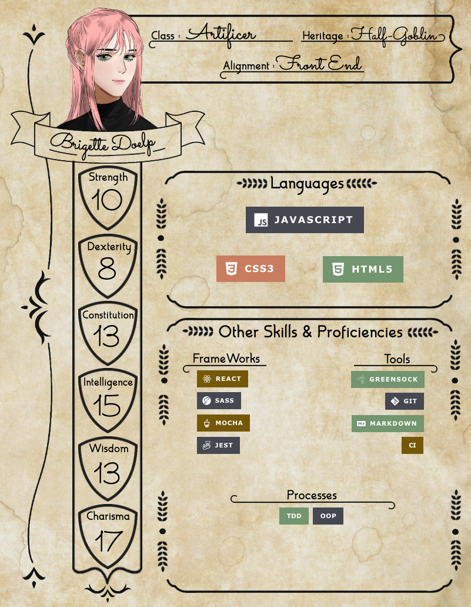

 

    

<h1>Front End Developer</h1>
<h5>She/Her || They/Them</h5>

A half-goblin that has learned JavaScript and Front End Development.

#### Get To Know The Goblin
* I'm a recently graduated student of Turing School of Software and Design!
* My previous work was in sales, both in the car industry and the tabletop gaming industry.
* Personally invested in making the traditionally male industries of tech and nerd more inclusive for the gals, gays, and theys!
* React is my favourite.
* I want to make beautiful and useful things.
